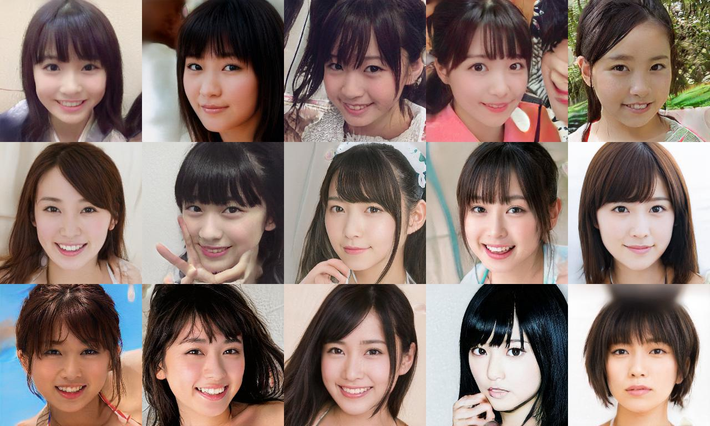

# Kawaii Girl Generator
このPythonモジュールはかわいい女の子を生成するためのモジュールです。
現在、下記画像のような顔画像の生成のみ対応しております。



## 利用方法
### 環境
* GPU: (I tested the code using RTX 2070)
* conda
* tensorflow-gpu: 1.14.0

### インストール方法
インストール方法の一例です。
```bash
git clone git@github.com:xiong-jie-y/kawaii_girl_generator.git

## Python環境の構築
conda create -n py37_cute_girl_generator python=3.7
conda activate py37_cute_girl_generator
conda install -y tensorflow-gpu==1.14.0
pip install pillow

## モデルの準備
python scripts/prepare_models.py
```

### 顔画像のランダム生成
```bash
cd kawaii_girl_generator
python examples/generate_random_images.py --num 2 output/
```

## License
ライセンスは`dnnlib/`以外は、[MIT License](https://github.com/xiong-jie-y/kawaii_girl_generator/blob/master/LICENSE)です。
`dnnlib/`以下のファイルはNVIDIAが実装したもので、次のリポジトリにあります。https://github.com/NVlabs/stylegan: 061cc4effdcd1da86a0cc6e61e64b575cf35ffa.　論文は[1].

## Authors
* Xiong Jie

## 免責事項
* 本モジュールを使用したことによる一切の損害について、開発者は責任を負いません。

## Bibliography
* [1] Tero Karras (NVIDIA), Samuli Laine (NVIDIA), Timo Aila (NVIDIA), "A Style-Based Generator Architecturefor Generative Adversarial Networks", http://stylegan.xyz/paper